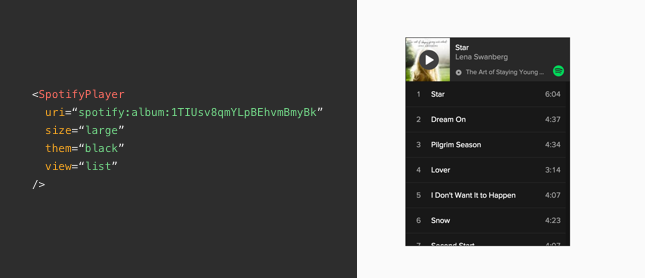

# react-spotify-player

[](https://www.npmjs.org/package/react-spotify-player)

Spotify player widget in React.



### Installation

`npm install react-spotify-player`

### Usage

```javascript
import SpotifyPlayer from 'react-spotify-player';

// size may also be a plain string using the presets 'large' or 'compact'
const size = {
  width: '100%',
  height: 300,
};
const view = 'list'; // or 'coverart'
const theme = 'black'; // or 'white'

<SpotifyPlayer
  uri="spotify:album:1TIUsv8qmYLpBEhvmBmyBk"
  size={size}
  view={view}
  theme={theme}
/>
```

Read more details about the player widget at the [Spotify Play Button docs](https://developer.spotify.com/technologies/widgets/spotify-play-button/).

### Developing

To build and build+watch source component:

```bash
npm run build
npm run dev
```

To build and build+watch examples files:

```bash
npm run build:examples
npm run dev:examples
```
